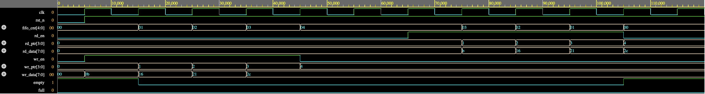

## REPORT

This mini project implements a **FIFO (First-In First-Out) Queue** in SystemVerilog with a fixed depth and data width. The FIFO is designed using a circular buffer approach and supports simultaneous write and read operations with flow control via `full` and `empty` signals.

---

## FIFO Design

- **Parameters**:
  - `DATA_WIDTH = 8`: Width of each data word
  - `DEPTH = 16`: Number of entries in the FIFO
  - `ADDR_WIDTH = clog2(DEPTH)`: Address width derived automatically

- **Internal Components**:
  - `mem`: Array holding the data entries
  - `wr_ptr`, `rd_ptr`: Write and read pointers
  - `fifo_cnt`: Counter for tracking the number of stored elements

- **Control Logic**:
  - **Write**: Occurs on rising clock edge when `wr_en` is high and FIFO is not `full`
  - **Read**: Occurs on rising clock edge when `rd_en` is high and FIFO is not `empty`
  - **Full**: Asserted when `fifo_cnt == DEPTH`
  - **Empty**: Asserted when `fifo_cnt == 0`

- **Inputs**:
  - `clk`, `rst_n`: Clock and active-low reset
  - `wr_en`, `rd_en`: Enable signals for writing and reading
  - `wr_data[7:0]`: Data input for writing

- **Outputs**:
  - `rd_data[7:0]`: Data output from read
  - `full`, `empty`: Status flags

---

## Simulation Details

The project was simulated using **Questa 2024.3** on **EDA Playground** and **EPWave** for waveform generation. The testbench writes 4 values (11, 22, 33, 44) into the FIFO and then reads them back after a 2 posedge clk idle delay.

- Initial reset applied for 1 cycle
- Writes occur on four consecutive clock edges
- Reads occur two cycles later, one per clock cycle

---

### Waveform Output

The waveform verifies correct FIFO behavior:
- Writes occur on valid `wr_en` pulses
- `wr_ptr` increments correctly
- After a short delay, `rd_en` enables data retrieval
- `rd_data` matches written values in order
- `fifo_cnt` increases and decreases at the correct clock edges

---

## Summary

This project demonstrates:

- A functional FIFO design using SystemVerilog
- Proper handling of pointer wrap-around and flow control
- Use of counters and conditionals for full/empty flags
- Pipelined testbench to validate read/write timing
- Visual waveform inspection using EPWave and Questa
